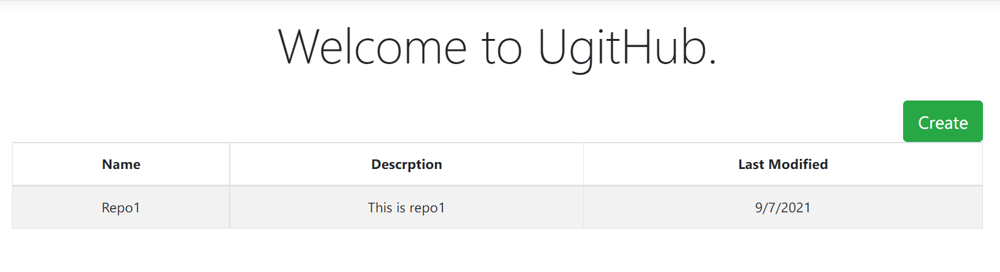
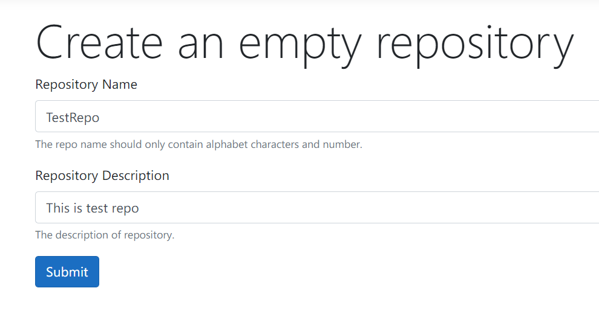
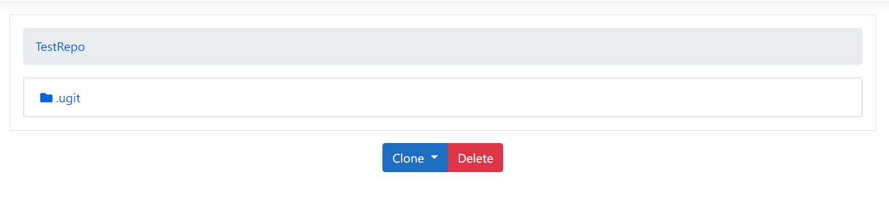
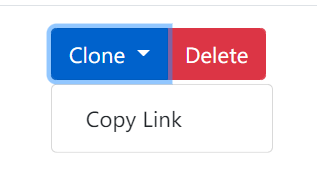
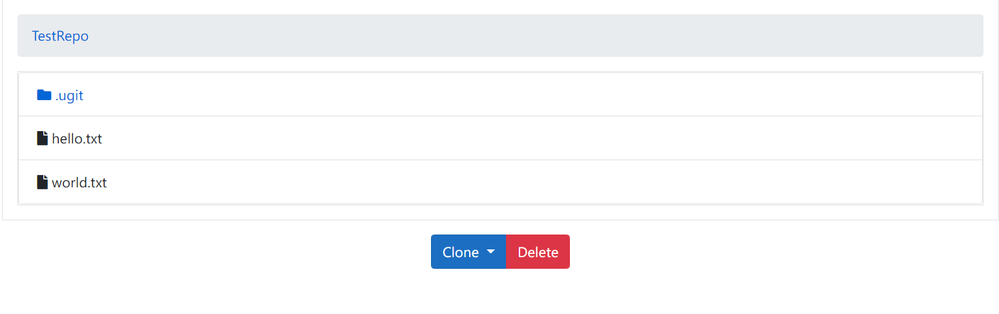

[](https://coveralls.io/github/gaufung/ugit)
[](https://github.com/gaufung/ugit/issues)
[](https://github.com/gaufung/ugit/blob/master/LICENSE)
[](https://GitHub.com/gaufung/ugit/releases/)


# What is **Ugit** ?

*ugit* is [git](https://en.wikipedia.org/wiki/Git) basic implementation by C# language. Origianlly, it's inspired by Nikita's [ugit](https://www.leshenko.net/p/ugit/). It supports the git basic features. 
- ugit add 
- ugit commit 
- ugit tag 
- ugit merge
- ugit branch
- ugit push/fetch
- ...

# Prequirements 
- .Net 5.0
- diff command
  - diff.exe (Windows)
  - diff (*nix)

# Component 
- Tindo.Ugit: `Ugit` core library. 
- Tindo.Ugit.CLI: `Ugit` client tool
- Tindo.Ugit.Server: `Ugit` server client.

# Features

## Basic Operations 

- Initilize an empty repository. 
```
> ugit init
Initialized empty ugit repository in C:\Users\fenga\ugitsample\.ugit
```
- Check out the status

```
> ugit status
On branch master
```

- Create file and add to repo

```
> echo "Hello ugit" > ugit.txt
> ugit status
On branch master

Changes not staged for commit:
new file: ugit.txt

> ugit add .\ugit.txt
> ugit status
On branch master

Changes to be committed:
new file: ugit.txt

> ugit commit -m "add ugit.txt file"
8c97a7f70b724764e607efccf3d7c424585f766e
```

- Check out the log 

```
> ugit log
commit 8c97a7f70b724764e607efccf3d7c424585f766e(HEAD,refs\heads\master)

add ugit.txt file
```

- Create branch and merge

```
> ugit branch dev
Branch dev create at 8c97a7f70b
> ugit checkout dev

> echo "Hello dev ugit" > dev.txt
> ugit add .\dev.txt
> ugit commit -m "add dev.txt"
25f1f60dbf3decd6bdb20d8178d68e9ed2b40821

> ugit checkout master
> ugit merge dev
```

- Crete Tag

```
> ugit tag v1.0
> ugit tag
v1.0
```

## Push/Pull remote server

- Start the `Tindo.Ugit.Server` and configure the `RepositoryDirectory`

```json
{
  "UgitServer": {
    "RepositoryDirectory": "C:\\Users\\gaufung\\ugitServerRepos"
  }
}
```



- Initilzie the Ugit reposistory in the server 




- Browse repository



- Clone repository



- Configure remote

```
> ugit remote origin "http://localhost:5000/TestRepo"
```

- Push and fetch origin 

```
> ugit fetch origin 
> ugit merge remote/master
> "hello ugit" >> world.txt
>> ugit add world.txt
>> ugit commit -m "second commit"
> ugit push origin master
```



# Tutorial
- [1 Introudction](https://fenga.medium.com/implement-git-by-yourself-3-command-parameters-a8a7279f95d6)
- [2 Data provider](https://fenga.medium.com/implement-git-by-yourself-2-data-provider-86c9fc07be0a)
- [3 Command Parameters](https://fenga.medium.com/implement-git-by-yourself-3-command-parameters-a8a7279f95d6)
- ...